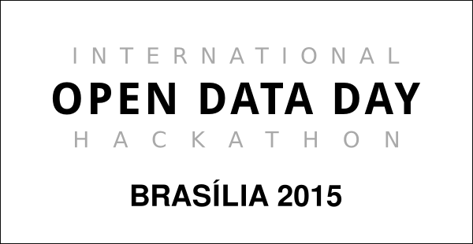

# open-data-day-2015

## Kit Básico do Mochileiro de Dados
Temos a proposta de N temas/opções para a Oficina de Exploração de APIs. Todas elas possuem ferramentas, softwares ou bibliotecas em comum e outras especificas para cada oficina.

Para instalar os softwares basicos, é só seguir os passos adiante:

### Se você for usuário de Debian/Ubuntu ou algum dos seus derivados:
1. Abra um terminal e digite:
```bash
sudo apt-get install python-dev python-setuptools python-pip nodejs npm git-core
```

### Se você for usuário de Fedora/CentOS/RedHat ou algum dos seus derivados:
1. Abra um terminal e digite:
```bash
sudo yum install python-devel python-setuptools python-pip nodejs npm git
```

### Agora o caminho é o mesmo para qualquer distribuição GNU/Linux
```bash
sudo pip install ipython virtualenv virtualenvwrapper
sudo npm install -g bower-cli grunt yo
```

A partir deste ponto, escolha uma das oficinas, siga as instruções indicadas e boa aventura!

1. [Navegação pela API da Camara dos Deputados](https://github.com/calangohc/cd-odd2015)
2. [Oficina de Mapeamento](https://github.com/calangohc/mapa-odd2015)
3. [Acesso a APIs com NodeRed / Javascript](https://github.com/calangohc/njs-odd2015)
4. [Mapeamento a partir de uma API](https://github.com/calangohc/gmaps-odd2015)
